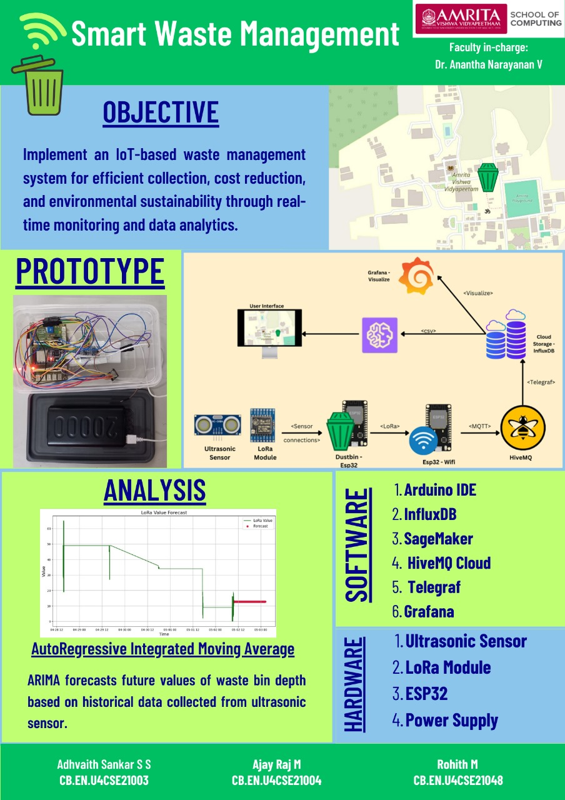

# Smart Waste Management System

Welcome to the Smart Waste Management System project.

## Project Overview
The project aims to enhance the efficiency of waste collection, reduce operational costs, and promote environmental sustainability by implementing an IoT-based smart waste management system.

## Key Features
- **Real-time Monitoring:** Uses ultrasonic sensors to monitor waste bin fill levels.
- **Automatic Status Updates:** Provides real-time status updates on a digital map.
- **Optimized Collection Routes:** Designs efficient waste collection routes based on collected data.
- **Data Analytics:** Analyzes data to predict future waste levels and optimize collection schedules.
- **User-friendly Interface:** Displays real-time data and suggested collection routes for waste collection personnel.

## Technologies Used
- **Hardware:** ESP32 microcontrollers, ultrasonic sensors, LoRa communication modules.
- **Software:** MQTT protocol, HiveMQ Cloud, Amazon SageMaker, Google Colab.
- **Cloud Infrastructure:** InfluxDB for data storage, machine learning models for analytics.

For detailed documentation, please refer to the attached PDF.

## Project Team
- **Adhvaith Sankar S S** 
- **Ajay Raj M** 
- **Rohith M**

## Table of Contents
1. Objective
2. Hardware Selection and Design
3. Software Design
4. IoT System Design
5. Integration of End, Edge, and Cloud
6. Data Accumulation and Processing
7. IoT Analytics
8. Sample Test Cases and Reports
9. Outcomes
10. Conclusion and Future Scope

